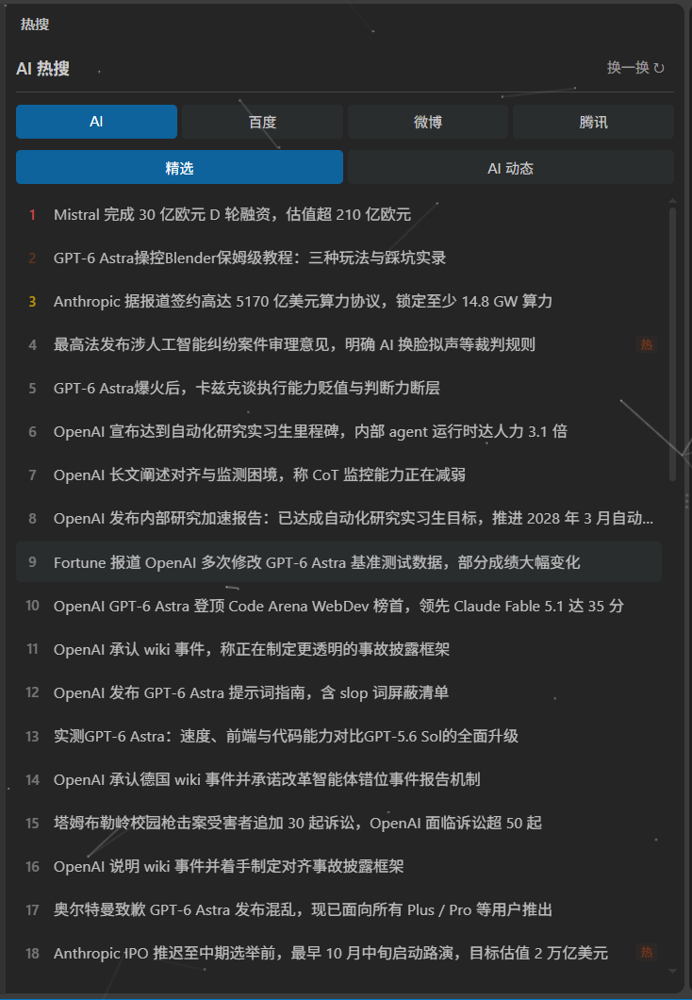

# Hot Search

Cursor / VS Code 侧边栏看 AI 热点（[AI HOT](https://aihot.virxact.com)）和百度、微博、腾讯热搜，状态栏轮播当前榜单。



## 怎么用

1. 左侧 Activity Bar 点 **🔥** 打开侧边栏
2. 切换 **AI / 百度 / 微博 / 腾讯**；AI 有 **精选 / AI 动态** 两个榜，百度有 **热搜榜 / 财经榜**
3. AI 条目悬停可看摘要、来源和发布时间；点条目打开链接，点 **换一换** 刷新
4. 左下角状态栏轮播热搜（跟随侧边栏当前 tab，默认 AI 精选），点击跳转到侧边栏

设置里搜 `hotSearch` 可改：打开方式（浏览器 / 内置）、轮播间隔。

启动时会拉取一次 AI 精选供状态栏轮播；侧边栏在打开或手动刷新时拉取。不会后台定时轮询。AI 数据来自 [aihot.virxact.com](https://aihot.virxact.com/agent) 的公开 API（匿名、无需 token）。

数据有本地缓存：AI 榜 5 分钟内、其他榜 1 分钟内切换不会重复请求（服务端本身也是 5 分钟缓存，拉得更勤数据也不会变）；**换一换** 强制刷新，最快 10 秒一次。请求失败时自动回退展示上次数据。

## 调试

```bash
npm install
npm run watch    # 保持编译，另开终端跑着
```

1. 用 Cursor 打开本项目
2. 按 **F5**（或 Run → Start Debugging）
3. 会弹出一个新的 **Extension Development Host** 窗口，扩展在这个窗口里生效
4. 改 `src/` 代码 → 保存 → 新窗口里 **Reload Window** 看效果

## 打包

```bash
npm run package
```

项目根目录会生成 `hot-search-x.x.x.vsix`。

## 安装 .vsix

**手动安装**

Extensions 面板 → 右上角 `...` → **Install from VSIX...** → 选 `.vsix` → Reload Window

**命令行安装（Cursor / VS Code 都行）**

```bash
cursor --install-extension hot-search-0.2.5.vsix --force
# 或
code --install-extension hot-search-0.2.5.vsix --force
```

装完 Reload Window。已有旧版时加 `--force` 覆盖。

## 改功能

代码在 `src/`，结构很简单：

- `src/trend/` — 各平台数据抓取（AI HOT / 百度 / 微博 / 腾讯）
- `src/webview/` — 侧边栏 UI
- `src/statusBar.ts` — 状态栏轮播
- `src/extension.ts` — 入口

想加平台、改样式、改逻辑：**fork 后用 AI 改就行**，把需求丢给 Cursor / Copilot，指到对应文件让它改。仅限个人非商用，详见下方 License。

## License

**个人免费使用，禁止商用。**

- 可以：自用、fork、改代码、分享给朋友
- 不可以：收费分发、打包进商业产品、上架售卖、任何盈利用途

完整条款见 [LICENSE](LICENSE)。商用请联系作者 HummerBor 授权。
